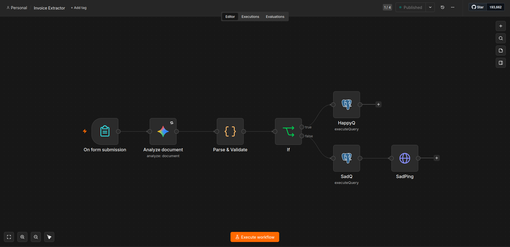
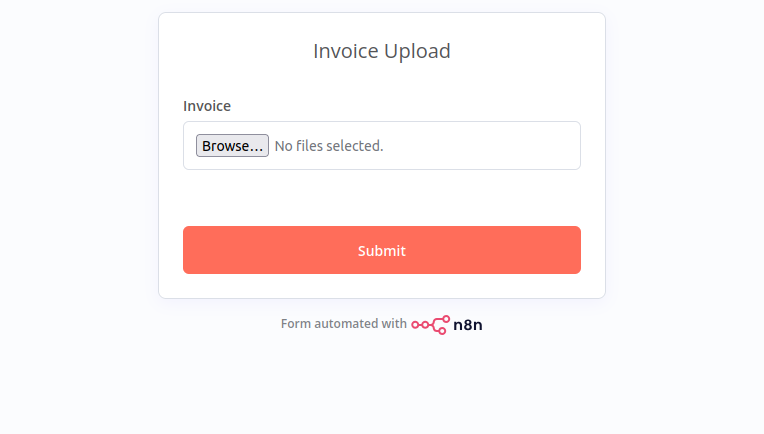
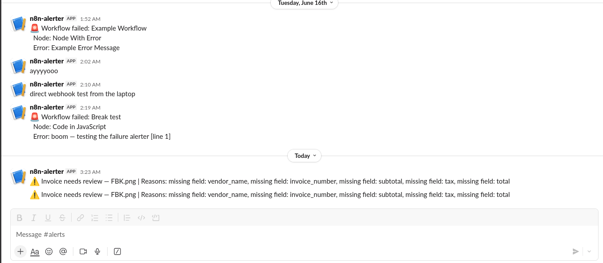

# AI Invoice Extraction Pipeline

An n8n automation that helps a finance or ops team get invoice data into a database without hand-keying it, and without trusting whatever the AI guessed.

Gemini reads the uploaded file and returns JSON. The pipeline then refuses to take that JSON at face value. Every extraction is validated, and anything that fails a check is sent to a review queue with the reasons attached, instead of being saved as if it were correct.

That refusal is the actual point of the project. Getting an LLM to turn a PDF into JSON is a five-minute demo. The useful problem is what you do when it misreads a total or invents a vendor, and that is the part I built around. The schema is invoice-shaped right now; swapping it to receipts, contracts, or forms is a prompt-and-table change, not a rebuild.

**Status:** live and published on my self-hosted n8n instance (see the [platform project](../self-hosted-n8n-platform/) it runs on), reachable over a Cloudflare tunnel. In this folder: the exported workflow (`invoice-extractor.workflow.json`), the schema (`schema.sql`), and my interview notes (`interview-notes.md`).

## Demo

The whole pipeline. Upload, read, validate, then branch to either the database or the review queue:



How someone uses it. A plain upload form, no login required, so anyone can drop in a file:



A rejection in action. A file with no invoice data was caught and posted to Slack with the exact reasons, instead of being saved as if it were real:



## Why I built it

Invoice entry is everywhere, dull, and easy to get wrong, which is exactly why people are throwing AI at it. The trap is that the AI is sometimes confidently wrong and nobody checks. I wanted a piece that demonstrated the checking, not the party trick. It also let me reuse the Slack alerting and self-hosted setup from my first project, so the two assets fit together.

## How it works

```
On form submission (file upload, no OAuth)
   -> Analyze document   (Gemini 2.5 Flash reads the PDF/image, returns strict JSON)
   -> Parse & Validate   (Code node: parse safely, then five checks)
   -> If (valid?)
       valid   -> HappyQ -> INSERT into invoices          (idempotent on re-upload)
       invalid -> SadQ   -> INSERT into invoices_review    (with the errors)
                  -> SadPing -> Slack #alerts ("needs review" + reasons)
   on crash / exhausted retries -> Failure Alerts -> Slack
```

A rejected invoice is not an error. The run still completes as a success, because handing a bad extraction to a human is the system doing its job. The error path is reserved for real failures, like Gemini being down or the database being unreachable. Those two situations need different handling, so they get different paths.

## The reliability core

`Parse & Validate` strips any code fences off Gemini's reply and runs `JSON.parse` inside a try/catch, so a malformed answer is caught instead of crashing the node. Then five checks decide whether the data is trustworthy:

1. The JSON actually parsed.
2. The essentials are present and not null: vendor, invoice number, subtotal, tax, total.
3. The money fields are real numbers.
4. `line_items` is an array.
5. Subtotal plus tax reconciles to the total, within a cent.

Check five is the one I care about most. It catches a single misread digit even when the JSON is perfectly well-formed, which is the failure that actually costs a finance team money. The node returns `{ valid, errors, data }`, and the `If` node branches on that flag.

I handle the two kinds of failure with two different tools. A flaky API call (rate limit, model overloaded, a network blip) gets **Retry On Fail** on the Gemini node, three tries, five seconds apart. A call that succeeds but returns garbage gets caught by validation. Retrying a confident wrong answer just gives you the same wrong answer, so retries and validation are not interchangeable.

## Data model

Two tables, defined in `schema.sql`:

- `invoices` holds validated data. Money is `NUMERIC(14,2)` rather than a float, so cents never drift. `line_items` is `JSONB`. A unique constraint on `(vendor_name, invoice_number)` blocks double entry, and re-uploading the same invoice is a no-op via `ON CONFLICT DO NOTHING`.
- `invoices_review` is the human queue: the extracted `data`, the `errors` that explain the rejection, and the source filename.

## Stack, and the reasons behind it

- **n8n**, self-hosted in Docker, for orchestration.
- **Gemini 2.5 Flash** to read the document. It has a free sustained tier with no card, reads PDFs and images directly so there is no separate OCR step, has a native n8n node, and returns structured JSON. The model node is swappable if a better or cheaper option shows up.
- **Postgres** for typed storage, and for the `JSONB` and `NUMERIC` guarantees.
- **Slack** for review notifications and crash alerts, reused from the platform project.
- **Form Trigger** for intake, chosen so there is no Gmail or OAuth wall. Anyone can drop a file in.

One detail I am happy with: the Slack webhook lives in an environment variable and the database and model credentials are encrypted inside n8n. None of them are in the workflow JSON, so the export in this folder is safe to commit.

## What I'd add next

- Give the business data its own database or schema. Right now it shares Postgres with n8n's own tables, which is fine for a demo but not how I'd run it for real.
- Put Cloudflare Access in front of the form. It has no auth today, on purpose, to keep the demo at zero cost.
- Add a confidence threshold. The validation checks shape and arithmetic, not whether the vendor is genuine, so a low-confidence score or a vendor allow-list would be the next layer of trust.
